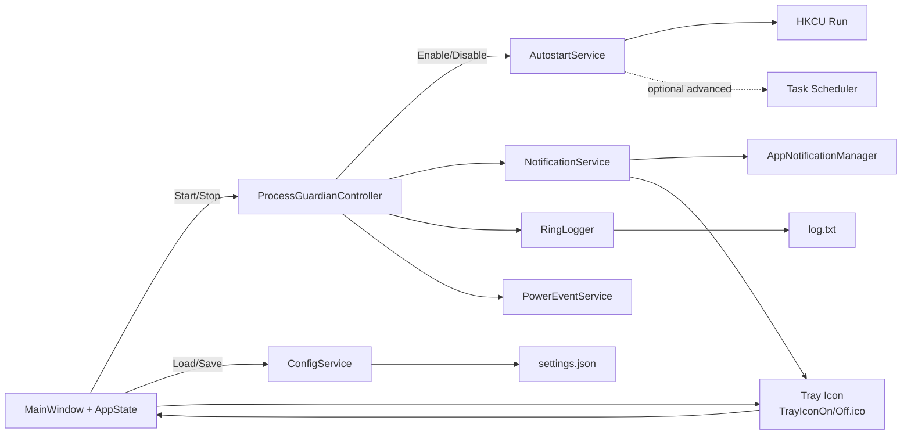
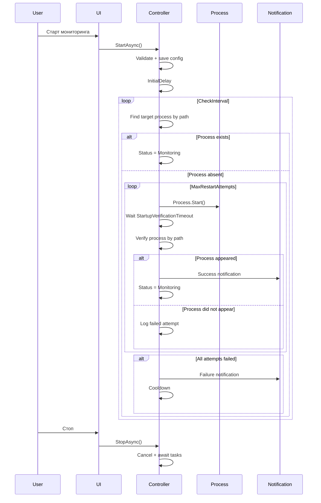

# Техническое задание: ProcessGuardian для Windows 11

Приложение **ProcessGuardian** — настольное приложение **WinUI 3 / Windows App SDK** на **.NET 8** для Windows 11. Назначение приложения — фоновый мониторинг выбранного пользователем процесса и автоматический перезапуск процесса при его неожиданной остановке.

## 1. Цель и границы проекта

Приложение должно:

- работать в пользовательском сеансе Windows без обязательных административных прав;
- мониторить один целевой EXE;
- при обнаружении остановки выполнять ограниченное число попыток его запуска;
- подтверждать именно факт появления целевого процесса после запуска, а не только успешность вызова `Process.Start()`;
- работать в фоне через системный трей;
- сохранять настройки и диагностический журнал;
- поддерживать запуск после входа пользователя в Windows;
- корректно переживать сон/пробуждение и штатное завершение приложения.

В текущей версии **не требуется** поддержка нескольких целевых процессов, нескольких экземпляров одного EXE, выбора процесса по PID, фильтрации по пользователю или по защищённому пути. Эти функции можно оставить за пределами MVP.

## 2. Ключевые технические решения

- **UI:** WinUI 3 с `H.NotifyIcon.WinUI` для системного трея. Окно содержит настройки, статус, кнопки «Старт»/«Стоп», «Свернуть в трей» и «Выход».
- **Мониторинг:** отдельный `ProcessGuardianController` с асинхронным циклом на `PeriodicTimer` + `CancellationToken`. Внутри контроллера не должно быть `Thread.Sleep` и синхронных длительных операций.
- **Идентификация процесса:** источник истины — полный путь к целевому EXE. `TargetProcessName` может использоваться как вспомогательный параметр для поиска процессов, но найденный процесс должен дополнительно проверяться по пути к исполняемому файлу. Нельзя считать любой процесс с тем же именем достаточным подтверждением, поскольку на системе могут существовать одноимённые EXE из разных каталогов.
- **Перезапуск:** `ProcessStartInfo` должен задавать полный `FileName`, корректный `WorkingDirectory` и аргументы. Предпочтительно использовать `ArgumentList`, а не собирать одну строку `Arguments`, чтобы избежать ошибок с кавычками и экранированием.
- **Подтверждение запуска:** после `Process.Start()` контроллер ожидает появления целевого процесса в течение отдельного `StartupVerificationTimeout`. Успешный возврат из `Process.Start()` сам по себе не считается успешным перезапуском.
- **Защита от повторного запуска:** пока выполняется серия restart-attempts, новый цикл мониторинга не должен запускать ещё одну серию. После завершения серии контроллер возвращается к обычному состоянию.
- **Уведомления:** локальные app notifications через `Microsoft.Windows.AppNotifications` / `AppNotificationManager`. Для unpackaged-приложения используется `AppNotificationManager.Default.Register()`. При невозможности показать уведомление используется fallback через трей.
- **Права:** приложение не требует запуска от администратора. Мониторинг процесса выполняется в контексте текущего пользователя; приложение не должно пытаться повышать привилегии автоматически.
- **Автозапуск:** основной способ — `HKCU\Software\Microsoft\Windows\CurrentVersion\Run` с аргументом `--background`. Папка Startup не нужна как обязательное дублирование и может быть удалена из MVP. Task Scheduler — отдельная advanced-функция и не должна быть необходимой для базовой работы.
- **Конфигурация:** JSON в пользовательском каталоге приложения. Для Windows App SDK 2.x допускается использовать `ApplicationData.GetForUnpackaged()`; допустим также `%APPDATA%\ProcessGuardian`, если реализация сознательно остаётся на обычной файловой системе.
- **Логирование:** потокобезопасный кольцевой буфер с ограничением по числу записей и/или размеру файла. Ошибка записи лога не должна останавливать мониторинг.
- **Single-instance:** `AppInstance.FindOrRegisterForKey()` с перенаправлением активации на уже запущенный экземпляр.

## 3. Платформа и версии

- ОС: **Windows 11**.
- Target Framework: `net8.0-windows10.0.19041.0` или новее.
- .NET: **8.0**.
- Windows App SDK: использовать стабильную поддерживаемую версию и **зафиксировать точную версию в проекте**, а не диапазон `1.6+`.
- На дату подготовки данного ТЗ актуальная стабильная версия Windows App SDK — **2.3.1** (релиз 16 июля 2026 года). В проекте необходимо зафиксировать именно эту стабильную версию, если используемый Visual Studio toolchain её поддерживает. urlWindows App SDK downloadshttps://learn.microsoft.com/en-us/windows/apps/windows-app-sdk/downloads
- Приложение: **unpackaged**.
- Публикация: self-contained single-file для выбранной архитектуры, минимум `win-x64`.

> Важно: unpackaged self-contained приложение включает Windows App SDK runtime в собственный deployment, но single-file режим всё равно выполняет extraction зависимостей при первом запуске. urlDistribute an unpackaged WinUI 3 apphttps://learn.microsoft.com/en-us/windows/apps/package-and-deploy/unpackage-winui-app

## 4. Компоненты и библиотеки

| Компонент | Назначение |
|---|---|
| WinUI 3 / Windows App SDK | UI, lifecycle, notifications, современные Windows API |
| .NET 8 | Основной runtime и язык C# 12 |
| `H.NotifyIcon.WinUI` | Системный трей, контекстное меню, fallback-уведомления |
| `Microsoft.Windows.AppNotifications` | Локальные app notifications через Windows App SDK |
| `Microsoft.Win32.Registry` | `HKCU\Run` для автозапуска |
| `Microsoft.Win32.SystemEvents` | `PowerModeChanged` для Suspend/Resume |
| Windows Storage Picker / FileOpenPicker | Выбор целевого EXE |
| Task Scheduler Managed Wrapper | Только для отдельного advanced-режима, если он действительно понадобится |
| Собственный код | Controller, ConfigService, AutostartService, NotificationService, RingLogger, AppState и т. д. |

Пакеты должны использоваться только в той версии, которая совместима с выбранной версией Windows App SDK. Не следует добавлять `Microsoft.Win32.SystemEvents` вручную в старой версии, если она конфликтует с зависимостями других пакетов; версия пакета должна быть согласована NuGet restore.

## 5. Архитектура



### Основные компоненты

- **App / AppState** — единый источник состояния приложения: `MonitoringActive`, `Status`, текущие настройки, последний результат проверки, количество попыток.
- **MainWindow** — редактирование настроек и управление мониторингом.
- **TrayIcon** — постоянный значок в системном трее. Использует `TrayIconOn.ico` в режиме «Старт» и `TrayIconOff.ico` в режиме «Стоп». Меню: «Открыть», «Старт», «Стоп», «Выход».
- **ProcessGuardianController** — основной state machine мониторинга и перезапуска.
- **AutostartService** — включение/отключение выбранного способа автозапуска.
- **NotificationService** — app notifications + fallback в трей.
- **ConfigService** — загрузка, валидация, сохранение и миграция конфигурации.
- **RingLogger** — асинхронная запись журнала.
- **PowerEventService** — обработка Suspend/Resume.

## 6. Состояния контроллера

Для исключения неоднозначности рекомендуется явно определить состояния:

- `Stopped` — мониторинг отключён пользователем;
- `WaitingInitialDelay` — активен, но ожидает InitialDelay;
- `Monitoring` — выполняется обычный цикл проверки;
- `Restarting` — выполняется серия попыток запуска;
- `Cooldown` — после неудачной серии действует пауза;
- `Error` — конфигурация или системная ошибка не позволяют продолжать мониторинг.

`Error` не должен означать «целевой процесс сейчас не запущен»: отсутствие процесса и неудачный restart — разные состояния. В UI желательно показывать отдельные понятные статусы вроде «Ожидание запуска», «Перезапуск», «Ошибка перезапуска».

## 7. Жизненный цикл

### Запуск приложения

1. Выполнить single-instance проверку до инициализации основного UI.
2. Зарегистрировать `AppNotificationManager` и обработчик активации уведомлений.
3. Загрузить конфигурацию.
4. Если приложение запущено с `--background` и `MonitoringEnabled == true`, запустить контроллер без показа главного окна.
5. В обычном запуске показать главное окно.

### Старт мониторинга

1. Валидировать конфигурацию.
2. Сохранить настройки.
3. Установить `MonitoringEnabled = true`.
4. Запустить контроллер.
5. После старта пройти `InitialDelay`.
6. Перейти в обычный цикл мониторинга.

`AutostartEnabled` не меняется автоматически, если пользователь не менял именно настройку автозапуска.

### Стоп мониторинга

1. Отменить `CancellationToken` контроллера.
2. Дождаться завершения текущей операции запуска/проверки, не оставляя фоновых задач.
3. Установить `MonitoringEnabled = false`.
4. Установить состояние `Stopped`.

`AutostartEnabled` сохраняется; физическое удаление записи автозапуска выполняется только при явном отключении пользователем автозапуска.

### Закрытие окна

Если мониторинг активен — X скрывает окно, но приложение продолжает работать в трее.

Если мониторинг не активен — X может завершить приложение либо также скрывать его; в рамках MVP рекомендуется сохранить текущее правило: при остановленном мониторинге X завершает приложение.

### Выход из трея

Явная команда «Выход» должна:

1. остановить мониторинг;
2. отменить фоновые задачи;
3. отключить автозапуск только в том случае, если его состояние связано именно с активным мониторингом;
4. освободить tray icon и event handlers;
5. корректно завершить приложение.

## 8. Мониторинг целевого процесса

### Идентификация

В настройках хранится:

- `TargetProcessPath` — канонический полный путь к EXE;
- `TargetProcessName` — имя без `.exe`, вычисляемое из пути и хранимое только для удобства/диагностики.

При проверке необходимо:

1. получить процессы с соответствующим именем;
2. для каждого доступного процесса попытаться определить полный путь (`Process.MainModule.FileName` с обработкой `Win32Exception`, `UnauthorizedAccessException` и завершения процесса между вызовами);
3. сравнить путь с `TargetProcessPath` без учёта регистра и с нормализацией пути;
4. считать процесс запущенным только при совпадении пути.

Если получить путь процесса невозможно из-за прав доступа, это должно логироваться как отдельный диагностический результат, а не интерпретироваться автоматически как «процесс отсутствует».

### Псевдокод

```csharp
public async Task RunAsync(CancellationToken ct)
{
    await Task.Delay(
        TimeSpan.FromSeconds(_settings.InitialDelaySeconds), ct);

    using var timer = new PeriodicTimer(
        TimeSpan.FromSeconds(_settings.CheckIntervalSeconds));

    while (await timer.WaitForNextTickAsync(ct))
    {
        await MonitorOnceAsync(ct);
    }
}
```

`MonitorOnceAsync` не должен запускать новую серию restart-attempts, если другая серия уже выполняется.

## 9. Перезапуск процесса

Алгоритм:

1. Проверить, что целевой процесс действительно отсутствует.
2. Выполнить до `MaxRestartAttempts` попыток.
3. Для каждой попытки создать новый `ProcessStartInfo`.
4. Использовать полный путь к EXE.
5. Передать аргументы через `ArgumentList`, если возможно.
6. Задать `WorkingDirectory = Path.GetDirectoryName(TargetProcessPath)`.
7. Запустить процесс.
8. Ожидать `RestartDelaySeconds`, после чего проверять появление процесса.
9. Если процесс появился — серия считается успешной.
10. При ошибке старта записать код/сообщение ошибки в лог и перейти к следующей попытке.
11. После исчерпания попыток перейти в `Cooldown`.

Пример принципиального запуска:

```csharp
var psi = new ProcessStartInfo
{
    FileName = settings.TargetProcessPath,
    WorkingDirectory = Path.GetDirectoryName(settings.TargetProcessPath)!,
    UseShellExecute = true
};

foreach (var argument in settings.TargetProcessArguments)
    psi.ArgumentList.Add(argument);

using var process = Process.Start(psi);
```

Если UI предоставляет пользователю одну строку аргументов, необходимо либо использовать корректный Windows command-line parser, либо явно определить формат ввода. Нельзя автоматически считать любую строку безопасным эквивалентом `ArgumentList`.

### Важное исправление исходного ТЗ

Параметр `UseShellExecute = true // или false в зависимости от нужд` был слишком неопределённым. В рабочем ТЗ должен быть выбран один вариант и указаны основания. Для запуска выбранного локального `.exe` без перенаправления stdout/stderr допустимо использовать `true`; при необходимости перенаправления потоков используется `false`. `WorkingDirectory` имеет разную семантику при `true` и `false`, поэтому реализация должна учитывать это различие.

### Проверка после запуска

Нужно добавить отдельный параметр:

- `StartupVerificationTimeoutSeconds` — максимальное время ожидания появления процесса после `Process.Start()`.

Это закрывает важный дефект исходного псевдокода: приложение могло стартовать и почти сразу завершиться после фиксированной задержки, либо стартовать дольше этой задержки.

## 10. Автозапуск

### Основной вариант

Использовать только:

`HKCU\Software\Microsoft\Windows\CurrentVersion\Run`

со значением вида:

```text
"C:\Users\...\ProcessGuardian.exe" --background
```

`Run` предназначен для запуска программы при каждом входе пользователя в систему и не требует административных прав для пользовательской ветки.

### Startup folder

Папка Startup удалена из обязательной части ТЗ. Одновременное использование `HKCU\Run` и Startup создаёт два независимых механизма автозапуска и повышает риск двойного запуска/сложности диагностики. Для MVP достаточно одного канонического способа.

### Task Scheduler

Task Scheduler оставить только как отдельный **advanced**-механизм. Он не должен быть нужен для стандартного пользовательского сценария.

Формулировку «создание/удаление задачи требует elevation» следует убрать как безусловное правило: требуемые права зависят от того, какие параметры и principal используются при создании задачи. В ТЗ следует просто зафиксировать, что advanced-вариант должен явно сообщать пользователю о требованиях выбранной конфигурации и корректно обрабатывать отказ в доступе.

### Связь с мониторингом

Рекомендуется **не удалять автозапуск при обычном `Exit`**, если пользователь ранее включил его отдельно. Иначе «Выход» из трея неожиданно изменяет пользовательскую настройку автозапуска.

Поэтому лучше разделить:

- `MonitoringEnabled` — должен ли мониторинг работать после следующего входа пользователя;
- `AutostartEnabled` — должен ли ProcessGuardian запускаться при входе пользователя.

Обычная команда «Стоп» может автоматически отключать `MonitoringEnabled`, но не обязана физически удалять настройку автозапуска, если пользователь включил её независимо.

## 11. Уведомления

Использовать `Microsoft.Windows.AppNotifications` и `AppNotificationManager`.

При старте приложения:

```csharp
AppNotificationManager.Default.NotificationInvoked += OnNotificationInvoked;
AppNotificationManager.Default.Register();
```

Для unpackaged-приложений регистрация через `Register()` автоматически настраивает COM-регистрацию, необходимую для активации уведомлений.

Типы уведомлений:

- успешный перезапуск;
- исчерпаны попытки перезапуска;
- критическая ошибка конфигурации;
- при необходимости — восстановление мониторинга после Resume.

Текст уведомления должен содержать имя/путь целевого приложения, результат и количество попыток.

Fallback через трей должен использоваться при исключении/недоступности app notification API.

Не следует формулировать в ТЗ утверждение «уведомления не работают в elevated-процессе» как универсальный закон без тестирования конкретной версии API. Вместо этого требование должно быть практическим: **ProcessGuardian не запускается elevated и не требует elevation**.

## 12. Системный трей

`H.NotifyIcon.WinUI` подходит для WinUI 3 и предоставляет `TaskbarIcon`, контекстное меню и уведомления/tooltip.

Не следует жёстко фиксировать конкретный XAML API из старого примера (`DoubleClickCommand`, `ContextFlyout` и т. п.) как обязательный контракт библиотеки. Версия H.NotifyIcon может отличаться. В ТЗ фиксируется функциональность, а точный способ связывания команд выбирается по API установленной версии пакета.

Требования:

- иконка постоянно присутствует, пока процесс ProcessGuardian запущен;
- меню: «Открыть», «Старт», «Стоп», «Выход»;
- двойной клик открывает окно;
- скрытие окна не удаляет tray icon;
- выход корректно освобождает tray resources.

### Файлы иконок

Для системного трея использовать **отдельные ICO-файлы**, не `AppIcon.ico`:

```text
ProcessGuardian/
└── Assets/
    ├── AppIcon.ico
    ├── TrayIconOn.ico
    └── TrayIconOff.ico
```

Все три файла должны входить в проект и поставляться вместе с опубликованным приложением. Код не должен зависеть от текущего рабочего каталога; путь к ресурсам должен строиться относительно ресурсов приложения/каталога установки.

**`AppIcon.ico`** — единая основная иконка ProcessGuardian для всех мест, где требуется идентификация самого приложения, **кроме системного трея**. Она должна использоваться для:

- значка главного окна;
- заголовка окна, если используемый WinUI/Windows title bar поддерживает отображение icon;
- значка приложения на панели задач;
- ярлыка в меню «Пуск»;
- ярлыка на рабочем столе, если он создаётся;
- встроенного application icon исполняемого файла;
- других системных поверхностей Windows, где требуется иконка приложения.

`AppIcon.ico` не должен использоваться в качестве штатной иконки трея.

**`TrayIconOn.ico`** — иконка трея при режиме **«Старт»**, то есть когда мониторинг активен.

**`TrayIconOff.ico`** — иконка трея при режиме **«Стоп»**, то есть когда мониторинг неактивен.

Источник истины для выбора tray icon — `AppState.MonitoringActive`/эквивалентное состояние контроллера. Синхронизация должна быть следующей:

```text
MonitoringActive = true  -> TrayIconOn.ico
MonitoringActive = false -> TrayIconOff.ico
```

К режиму **«Старт»** относятся состояния `WaitingInitialDelay`, `Monitoring`, `Restarting` и `Cooldown`: во всех них используется `TrayIconOn.ico`. Для `Stopped` и состояния, при котором мониторинг не может продолжаться из-за ошибки конфигурации, используется `TrayIconOff.ico`.

При запуске приложения tray icon должна быть установлена сразу после загрузки конфигурации и затем синхронизирована с фактическим состоянием `AppState`. При командах «Старт»/«Стоп», запуске с `--background`, скрытии/восстановлении окна и после Resume значок не должен сбрасываться или рассинхронизироваться.

Если один из обязательных tray-файлов отсутствует или не может быть загружен, приложение не должно завершаться с исключением: проблему необходимо записать в лог и использовать безопасный fallback icon. `AppIcon.ico` может использоваться как **аварийный fallback**, но не как штатная tray icon.

### Требования к ICO

Файлы должны быть настоящими `.ico`, содержащими несколько размеров для разных DPI. Рекомендуемый набор: **16×16, 20×20, 24×24, 32×32, 40×40, 48×48, 64×64, 128×128 и 256×256 px**. Для tray icon особенно важны 16×16, 20×20, 24×24 и 32×32 с корректным альфа-каналом.

## 13. Конфигурация

Рекомендуемая структура:

```json
{
  "SchemaVersion": 1,
  "TargetProcessPath": "C:\\Path\\To\\App.exe",
  "TargetProcessArguments": [],
  "InitialDelaySeconds": 40,
  "CheckIntervalSeconds": 20,
  "MaxRestartAttempts": 4,
  "RestartDelaySeconds": 3,
  "StartupVerificationTimeoutSeconds": 10,
  "FailureCooldownSeconds": 90,
  "EnableLogging": true,
  "LogBufferSize": 500,
  "AutostartEnabled": true,
  "MonitoringEnabled": false
}
```

Изменения по сравнению с исходной схемой:

- `TargetProcessName` не является независимым пользовательским параметром;
- `TargetProcessArguments` предпочтительно хранить как массив строк;
- добавлен `StartupVerificationTimeoutSeconds`;
- `AutostartMode` убран из базовой схемы, потому что Registry — канонический MVP-механизм;
- `AutostartEnabled` отделён от `MonitoringEnabled`.

`ConfigService` должен:

- валидировать обязательные поля;
- проверять диапазоны числовых параметров;
- мигрировать старые версии схемы через `SchemaVersion`;
- писать файл атомарно, чтобы повреждение JSON при аварийном завершении не оставляло приложение без рабочей конфигурации;
- иметь безопасные значения по умолчанию.

## 14. Логирование

Лог должен содержать как минимум:

- старт/стоп ProcessGuardian;
- включение/отключение мониторинга;
- включение/отключение автозапуска;
- Suspend/Resume;
- начало и результат каждой проверки;
- номер restart-attempt;
- путь запуска;
- результат `Process.Start()`;
- результат проверки появления процесса;
- cooldown;
- ошибки уведомлений;
- ошибки конфигурации;
- исключения фонового контроллера.

Не логировать аргументы командной строки целевого процесса без необходимости: они могут содержать секреты.

`RingLogger` должен быть потокобезопасным. Ошибки диска/прав доступа не должны останавливать контроллер.

Кроме ограничения по количеству записей, желательно иметь ограничение размера файла. При превышении лимита старые записи удаляются/сдвигаются.

## 15. Sleep / Resume

Использовать `SystemEvents.PowerModeChanged`, который сообщает о suspend/resume системы.

При `Suspend`:

- не пытаться выполнять restart;
- отменить/приостановить ожидающие delay, если это необходимо;
- сохранить признак активного мониторинга.

При `Resume`:

- если мониторинг был активен, запустить новый `InitialDelay`;
- после него продолжить обычный мониторинг;
- не считать само по себе Resume признаком того, что целевой процесс остановился.

Не допускается запуск нескольких monitoring loops после нескольких Resume-событий.

## 16. Single-instance

Использовать `AppInstance.FindOrRegisterForKey()` с постоянным ключом. При втором запуске перенаправлять активацию в существующий экземпляр и завершать второй экземпляр. Это соответствует актуальному Windows App SDK app lifecycle API.

Нужно отдельно обработать аргументы `--background`/`--autostart`, чтобы второй запуск из автозагрузки не открывал UI.

## 17. Режимы запуска

Оставить два аргумента:

- `--background` — запуск без показа главного окна;
- `--autostart` — опциональный маркер, указывающий, что запуск инициирован автозапуском.

Для MVP достаточно одного `--background`. `--autostart` можно не реализовывать, если он не нужен диагностике; дублировать два семантически одинаковых аргумента не следует.

При `--background`:

- загрузить конфигурацию;
- проверить `MonitoringEnabled`;
- запустить мониторинг, если он включён;
- не показывать окно автоматически.

## 18. GUI

### Настройки

- InitialDelay после входа в Windows / Resume;
- CheckInterval;
- MaxRestartAttempts;
- RestartDelay;
- StartupVerificationTimeout;
- FailureCooldown;
- путь к EXE + «Обзор…»;
- аргументы командной строки;
- включение логирования;
- размер/лимит журнала;
- включение автозапуска.

### Статус

Минимум:

- Остановлено;
- Ожидание;
- Мониторинг активен;
- Перезапуск;
- Cooldown;
- Ошибка.

Нельзя использовать только цвет как средство передачи статуса: цвет должен сопровождаться текстом.

### Кнопки

- Старт;
- Стоп;
- Свернуть в трей;
- Выход.

Состояние кнопок должно быть недоступным для действий, которые сейчас логически невозможны: например, «Старт» недоступен во время уже активного мониторинга.

## 19. FileOpenPicker

Кнопка «Обзор…» должна выбирать именно `.exe`.

Для WinUI 3 desktop необходимо корректно привязать picker к HWND текущего окна перед показом picker (`InitializeWithWindow`/актуальный эквивалент для используемой версии API). После выбора:

- сохранить абсолютный путь;
- вычислить имя процесса из имени файла;
- проверить существование файла;
- обновить состояние UI.

## 20. Установка и публикация

### Publish

Для MVP рекомендуется выпускать **один дистрибутивный EXE**: unpackaged + self-contained + `PublishSingleFile`. Windows App SDK поддерживает single-file для unpackaged self-contained приложений (Windows App SDK 1.5+). При первом запуске зависимости извлекаются во временный каталог; это не является «нулевым извлечением».

Базовая команда:

```bash
dotnet publish -c Release -r win-x64 --self-contained true -p:PublishSingleFile=true -p:WindowsPackageType=None -p:WindowsAppSDKSelfContained=true -p:EnableMsixTooling=true -p:IncludeAllContentForSelfExtract=true
```

Эти свойства должны быть зафиксированы также в `.csproj`/publish profile, а не только передаваться командной строкой. Microsoft отдельно указывает `WindowsPackageType=None`, `WindowsAppSDKSelfContained=true`, `SelfContained=true`, `EnableMsixTooling=true`, `IncludeAllContentForSelfExtract=true` и `PublishSingleFile=true` для этого режима.

**Результат MVP:** основной дистрибутивный файл — `ProcessGuardian.exe`. Пользователь не должен вручную раскладывать DLL и runtime-файлы рядом с EXE.

Ограничение: single-file EXE всё равно выполняет extraction зависимостей во временный каталог при первом запуске. Если когда-либо потребуется буквально один исполняемый бинарник без extraction, этот deployment-вариант не подходит.

### Установка

Рекомендуемая директория пользователя:

```text
%LOCALAPPDATA%\ProcessGuardian\
```

Установка для MVP может быть выполнена без сложного MSI/MSIX-инсталлятора: достаточно разместить `ProcessGuardian.exe` в `%LOCALAPPDATA%\ProcessGuardian\` и создать ярлык в меню «Пуск»/на рабочем столе. При этом ярлык должен использовать `AppIcon.ico`/иконку EXE.

Если используется Inno Setup/WiX, installer должен:

- устанавливать основной `ProcessGuardian.exe`;
- создавать ярлыки;
- не включать Task Scheduler по умолчанию;
- не требовать elevation в базовом пользовательском сценарии, насколько это позволяет конкретная конфигурация installer.

`AppIcon.ico`, `TrayIconOn.ico` и `TrayIconOff.ico` являются логическими ресурсами приложения. При single-file publish они должны быть включены в bundle и доступны приложению после extraction через путь, основанный на `AppContext.BaseDirectory`; код не должен зависеть от текущего рабочего каталога.

Проверка deployment должна проводиться на чистой Windows 11 VM без Visual Studio.

## 21. Безопасность и устойчивость

- Не использовать `Process.Kill()` для целевого процесса в штатном алгоритме: задача приложения — обнаружить остановку и запустить процесс заново.
- Не запускать команды через `cmd.exe`, PowerShell или `shell`-строку, если можно напрямую запустить EXE.
- Проверять, что `TargetProcessPath` существует и имеет расширение `.exe`.
- Не принимать путь из конфигурации без повторной валидации после загрузки.
- Корректно обрабатывать ACL/доступ к EXE, `UnauthorizedAccessException`, файл, который исчез во время запуска, и гонки, когда процесс завершается между двумя проверками.
- Не хранить секреты в `settings.json`.
- Не допускать бесконечного рестарта без cooldown.

## 22. Обязательные тесты

### Конфигурация

- пустой путь;
- несуществующий EXE;
- каталог вместо EXE;
- неверное расширение;
- нулевые/отрицательные интервалы;
- слишком большое число попыток;
- повреждённый JSON;
- неизвестная будущая `SchemaVersion`.

### Мониторинг

- целевой процесс уже запущен;
- целевой процесс отсутствует;
- процесс завершается сразу после запуска;
- процесс запускается дольше `RestartDelaySeconds`;
- один или несколько одноимённых процессов из других каталогов;
- невозможно получить `MainModule.FileName` у постороннего процесса;
- EXE удалён между проверкой и `Process.Start()`.

### Перезапуск

- первый запуск успешен;
- успешен второй/третий attempt;
- все attempts неудачны;
- после неудачи запускается cooldown;
- после cooldown мониторинг возобновляется;
- во время restart-серии не запускается параллельная серия.

### Lifecycle

- запуск через обычный UI;
- запуск с `--background`;
- второй экземпляр приложения;
- автозапуск после входа пользователя;
- скрытие окна при активном мониторинге;
- выход из трея;
- Suspend → Resume;
- несколько последовательных Resume.

### Icons / tray

- `AppIcon.ico`, `TrayIconOn.ico` и `TrayIconOff.ico` включены в single-file bundle и корректно доступны приложению после extraction;
- при режиме «Старт» отображается `TrayIconOn.ico`;
- при режиме «Стоп» отображается `TrayIconOff.ico`;
- переход «Стоп -> Старт» меняет tray icon на `TrayIconOn.ico`;
- переход «Старт -> Стоп» меняет tray icon на `TrayIconOff.ico`;
- запуск с `--background` устанавливает корректную tray icon без показа окна;
- Suspend -> Resume не нарушает синхронизацию tray icon;
- `AppIcon.ico` используется для окна/taskbar/Start Menu/ярлыков и не является штатной tray icon;
- отсутствие tray icon-файла не приводит к падению приложения и фиксируется в логе.

### Notifications / tray

- toast при успешном восстановлении;
- toast после исчерпания attempts;
- fallback при исключении notification API;
- открытие окна из tray;
- Start/Stop из tray;
- корректное удаление tray icon при Exit.

### Deployment

- чистая Windows 11 VM без Visual Studio;
- установка из опубликованного набора;
- первый запуск;
- перезагрузка;
- деинсталляция;
- повторная установка;
- запуск без административной учётной записи с обычными правами пользователя.

## 23. Acceptance Criteria

Приложение считается готовым, если:

1. собирается в Release без ошибок и предупреждений, связанных с зависимостями проекта;
2. запускается как обычный пользовательский процесс;
3. корректно работает в трее без открытого окна;
4. после остановки целевого EXE обнаруживает отсутствие именно нужного процесса;
5. выполняет не более `MaxRestartAttempts` попыток;
6. считает попытку успешной только после фактического обнаружения целевого процесса;
7. не запускает параллельные серии restart-attempts;
8. после неудачи применяет cooldown;
9. сохраняет настройки между перезапусками;
10. работает после входа в Windows при включённом автозапуске/мониторинге;
11. корректно восстанавливает мониторинг после Resume;
12. второй экземпляр не создаёт второй tray icon и второй monitoring loop;
13. toast/fallback уведомления работают или корректно логируют невозможность уведомления;
14. журнал не способен уронить приложение при ошибке записи;
15. установка и удаление приложения не требуют админских прав в базовом пользовательском сценарии.

## 24. Что намеренно исключено из MVP

- несколько целевых процессов;
- выбор конкретного PID;
- запуск от другого пользователя;
- автоматическое повышение привилегий;
- Windows Service;
- watchdog с kernel/service-level защитой;
- удалённое управление;
- синхронизация настроек между устройствами;
- фильтрация процессов по пользователю/сессии;
- сложный Task Scheduler workflow.

Это позволит не усложнять первую версию и не смешивать обычный пользовательский watchdog с задачами, требующими системных прав.

## 25. Диаграмма последовательности



## 26. Ссылки на актуальную документацию

- [Windows App SDK — latest downloads](https://learn.microsoft.com/en-us/windows/apps/windows-app-sdk/downloads)
- [App notifications](https://learn.microsoft.com/en-us/windows/apps/develop/notifications/)
- [App notifications для unpackaged apps](https://learn.microsoft.com/en-us/windows/apps/develop/notifications/app-notifications/app-notifications-console)
- [App lifecycle / single instance](https://learn.microsoft.com/en-us/windows/apps/develop/launch/)
- [H.NotifyIcon](https://github.com/HavenDV/H.NotifyIcon)
- [ProcessStartInfo](https://learn.microsoft.com/en-us/dotnet/api/system.diagnostics.processstartinfo)
- [SystemEvents.PowerModeChanged](https://learn.microsoft.com/en-us/dotnet/api/microsoft.win32.systemevents.powermodechanged)

---

### Примечание о ревизии ТЗ

Основные изменения относительно исходного документа:

- устранена зависимость логики мониторинга только от имени процесса;
- добавлена проверка фактического появления процесса после `Process.Start()`;
- добавлен `StartupVerificationTimeoutSeconds`;
- исключена неоднозначность `UseShellExecute`;
- аргументы переведены на предпочтительный структурированный формат;
- автозапуск Registry отделён от состояния мониторинга;
- Startup folder убрана из MVP как дублирующий механизм;
- Task Scheduler оставлен только как advanced-функция без спорного утверждения о безусловной необходимости UAC;
- убрана необходимость фиксировать устаревший пример XAML API H.NotifyIcon как контракт;
- исправлено утверждение о текущей версии Windows App SDK: на дату ревизии стабильная актуальная версия — 2.3.1, а ветка 1.8 уже находится в maintenance.
- уточнено single-file/self-contained развёртывание unpackaged-приложения, включая extraction зависимостей при первом запуске;
- добавлена проверка single-instance после autostart/background сценариев;
- расширены тесты на одноимённые процессы, race conditions, повреждённую конфигурацию и повторные Resume.
